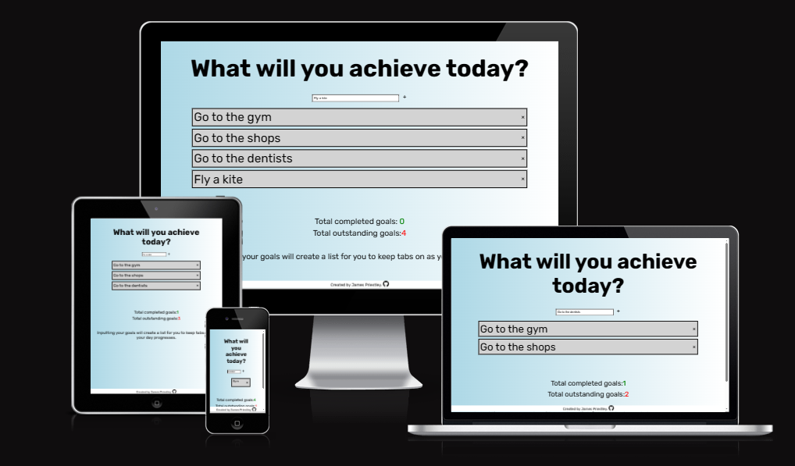
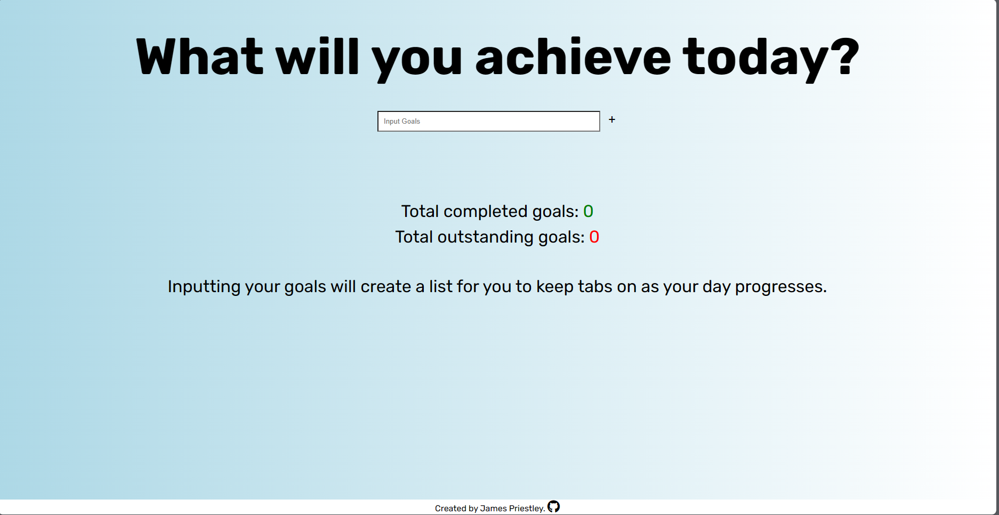
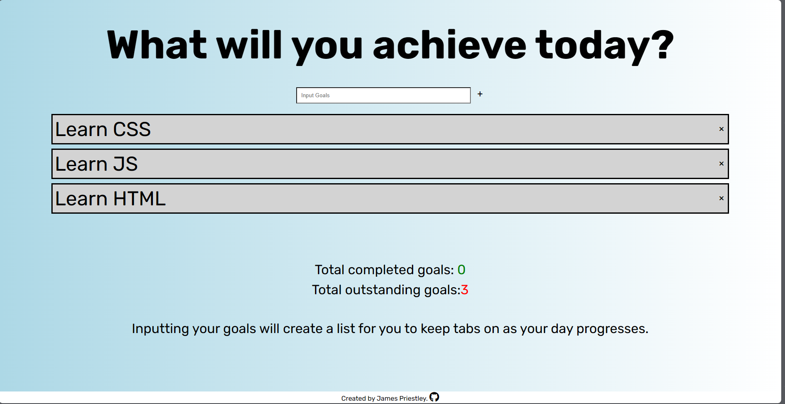
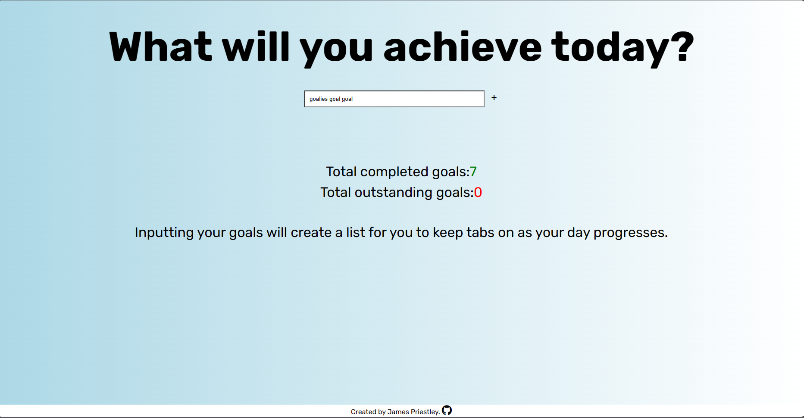
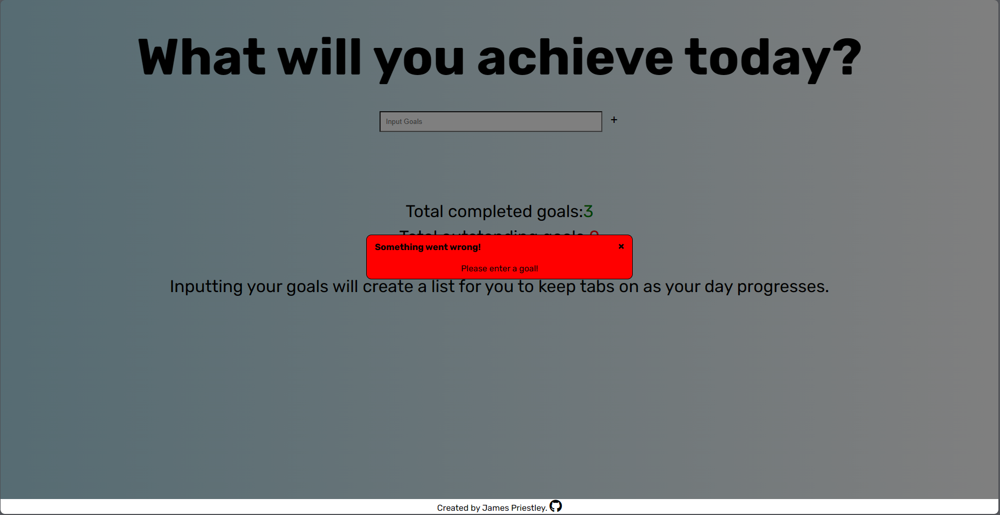
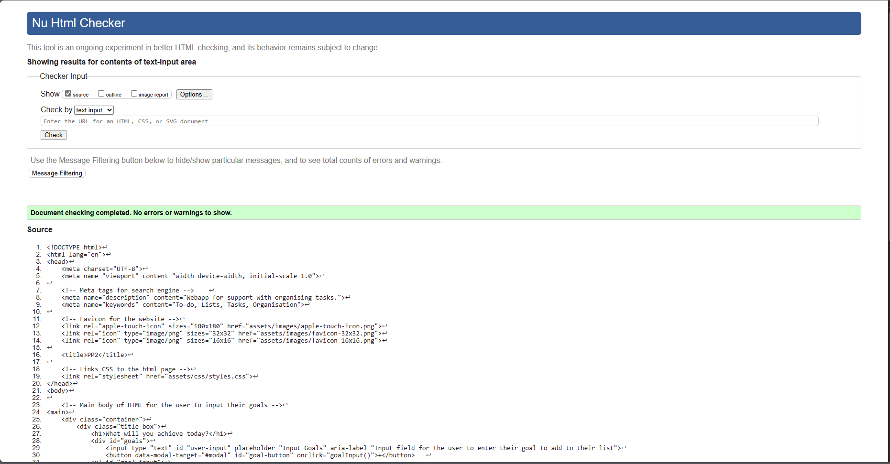
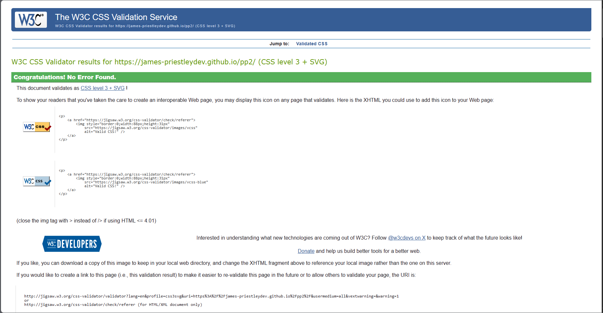
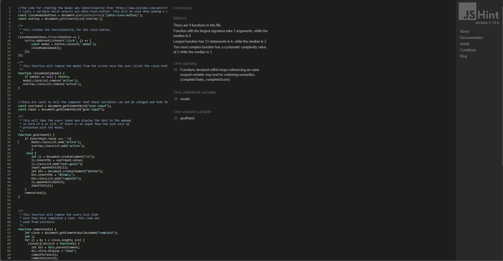
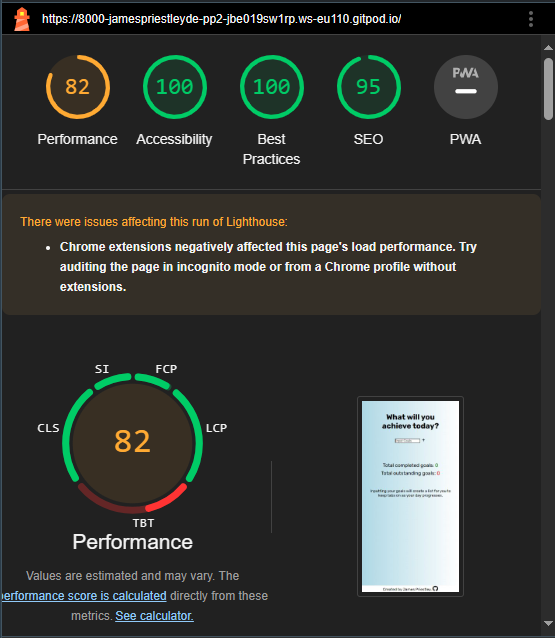

### TO-DO LIST

The To-Do List webapp is for anyone who is looking for a way to organise their daily goals. Users of this website will be able to enter their goals which they are
hoping to achieve on that given day and to help them track how many goals they have completed or have outstanding there is a tally on the webapp which counts
the users outstanding and completed goals.

The site is targeted towards people of any age, sex, gender, culture who are wanting to organise their day.

### Website Responsiveness

Here is an image of the website shown on varying screen sizes to show it's responsivness.

### FEATURES

Webapp displaying page with no entries

This is what the webapp looks like when the user first enters the webapp, there's a brief description of
the purpose of the webapp for the user to read before they get started with creating their list.

Webapp displaying listed items and tally of outstanding goals

This is what happens when the user inputs their goals it creates a list for the user and also tracks
how many goals they have inputted and tells them that they have X amount of goals outstanding.

Webapp displaying completed items and the tally of completed goals

This is what happens when the user has completed their tasks the counter on the 'completed goals' goes up with each
completed goal that the user does.

Modal (warning pop-up)

This is what happens when the user attempts to submit without entering a goal into the input box.
A warning appears alerting them that something has gone wrong and that they should enter a goal.

Footer

At the bottom of each page there is the footer.
The footer holds the text content which displays who created the webapp and also holds a link to my Github page if the user wanted
to see what other works me, the creator has made

### Testing

I have tested this page works on all browsers
I confirmed that this project works on all standard screen sizes using the devtools device toolbar
(Sizes were based off the dimentions given on the toolbar at the top of the 'device emulation' tool)
I confirm that all elements of the website are easy to read and easy to understand.
I have confirmed that the functions made in JS work by testing the website with different user inputs and with attempting to submit with no
user input to see if the pop-up warning works, which it does.

### Bugs

Debugged an issue which I created when adding the google-fonts to my css. 
I had fogotten to add a ';' to the end of the input resulting in all my css styling 
to become ignored by the PC.

Images were not displaying in the README.md - this was fixed when I spelt the names of the image correctly.

### Validator Testing

HTML
- There was an error when first validating the HTML as I left a '/' on line 29 and 2 floating </divs>.
 After removing this my HTML passed with no errors.

CSS
- No errors in the CSS when checking it with the offical W3C validator.

JSS
- The one warning which I got with my JS when putting it through JShint was for functions being declared within loops. However, I do not have loops
  and with that being said the JS has not provided any internal issues with the webapp nor is there any issues shown in the console of the devtools.
  Other than the warning which I have received for my JS I have also got one 'One undefined variable' and 'One unused variable' both of these are being
  used by the JS code. 
  The 'Undefiend variable' is the modal and it is used to open the modal if the user attempts to submit an empty input box.
  The 'Unused variable' is the goalInput() which is the main function on the webapp. This is also being used and works.
  I can prove this by the testing which I have done where I have removed both the 'modal' and the 'goalInput()' from my JS and the result
  of doing this was that neither the modal or the function worked. Putting the 'modal' and the 'goalInput()' back into my JS made the function
  and modal work as intended again.

Lighthouse tool check
- 

### Deployment

- The site was deployed to Github pages. The steps to deploy are as follows:
  - In the Github repository, navigate to the Settings tab
  - From the source section drop-down menu, select the Master Branch
  - Once the master branch has been selected, the page provided the link to the completed website

The live link can be found here: https://james-priestleydev.github.io/pp2/

### Future Implementations

I have a few ideas which I would like to add to the webapp if I had more time.
These are having the input field empty itself once the user has submitted their input.
Adding a timestamp to the users input to further add user experience to the webapp and allowing the user to know
when they added their goal.
Creating a way for the user to be able to add a due date for the goal they have inputted - allowing the user to
set themselves a deadline to achieve that specific goal.

### CREDITS

Reference for favicon image:

The favicon image was taken from: https://favicon.io/emoji-favicons/

All code which I have taken inspiration from or used to aid me with completing pp2 have comments above the code referring to the source
i used when writing it. 

Footer:

- Code for styling the footer was taken from my PP1 submission and ammended to suit PP2.

README.md

- The structure and layout of the README.md was taken from the SAMPLE README.md provided by Code Institute in the PP1 module of the course. 